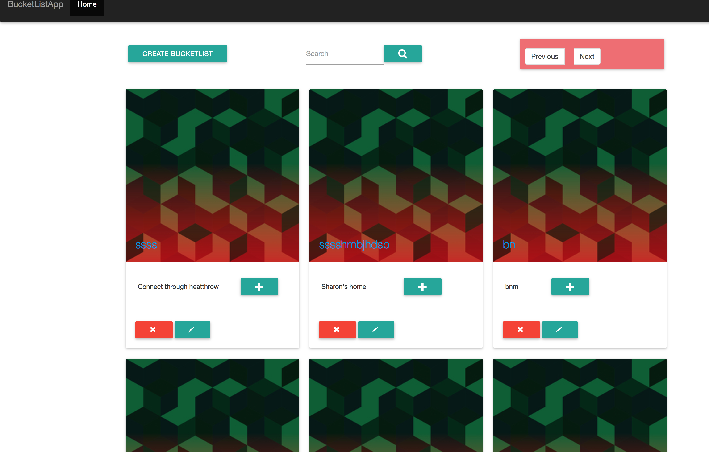

# Bucketlist FrontEnd
This is a web application created using angular2. It is an application that consumes flaskApi to do simple fuctionalities like creating a bucketlist, editing, deleting and adding items to it. <br/>
This project was generated with [angular-cli](https://github.com/angular/angular-cli) version 1.0.0-beta.28.3.

## Learning Materials
As a beginner in angualar2 the materials used to achieve the fully functional frontend were:<br/>
* Pluralsight angular2 course by Deborah Kurata.
* Angular website.
* Googling basic errors online and checking out user responses.
* Implementing angular2 applications using angular CLI.
* Cloning the angular2 CLI as the backbone of the application.
* Learning the basics of Javascript is also essential.

## Basic fuctionalities
```
User Login/ Registration.
User creating bucketlist.
User can view the bucketlist created immediately after creating it.
User adding items to the specific bucketlist.
User editing/deleting the bucketlist.
User can edit and delete the items they added to a particular bucketlist.
User can search a specific bucketlist.
Pagination of both bucketlists 
```
## To get the application up and running

* Clone the repository <br/>
 `https://github.com/andela-amutava/Bucketlist-Front-End.git`

* Navigate to the root folder <br/>
 `cd bucketlist-front-end`

* Install the modules <br/>
 `npm install`<br/>

* Run the server <br/> 
  `ng serve`

* Development server <br/> 
  Run `ng serve` for a dev server. Navigate to `http://localhost:4200/`. The app will automatically reload if you change any of the source files.

* Code scaffolding <br/> 
 Run `ng generate component component-name` to generate a new component. You can also use `ng generate directive/pipe/service/class/module`.
* Build <br/> 
 Run `ng build` to build the project. The build artifacts will be stored in the `dist/` directory. Use the `-prod` flag for a production build.

* Deploying to GitHub Pages <br/> 

 Run `ng github-pages:deploy` to deploy to GitHub Pages.

* Further help <br/> 
To get more help on the `angular-cli` use `ng help` or go check out the [Angular-CLI README](https://github.com/angular/angular-cli/blob/master/README.md).

## Screenshots for the user interface
## Main Page



